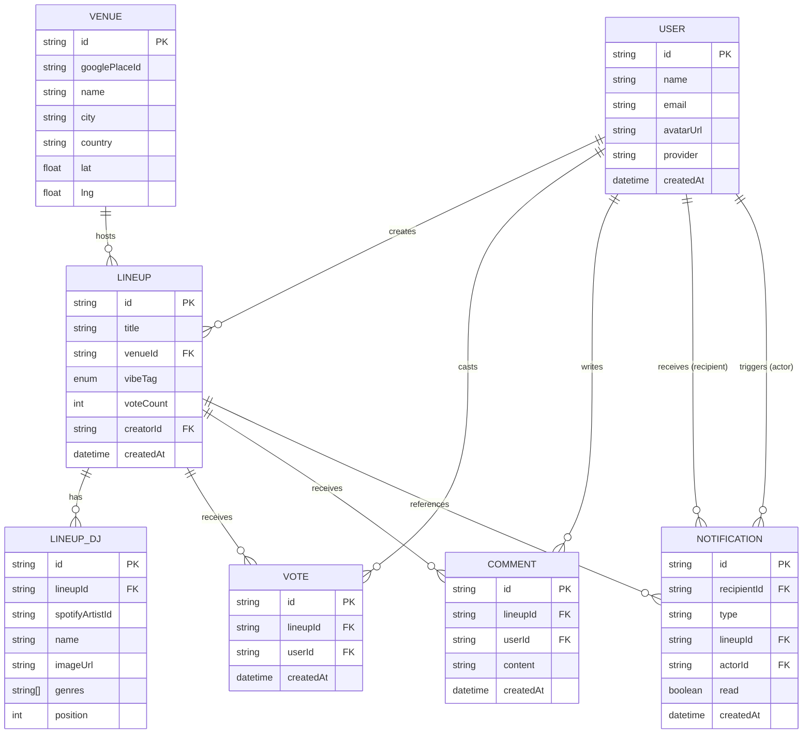

# CrowdPulse — Project Overview

> **One-liner:** A community platform where music fans craft and vote on dream DJ lineups for real venues — giving promoters a live signal of what crowds actually want to hear.

---

## 🧭 Table of Contents

- [The Idea](#the-idea)
- [User Types](#user-types)
- [Feature Map](#feature-map)
- [Data Model](#data-model)
- [Tech Stack](#tech-stack)
- [Screen Inventory](#screen-inventory)
- [Key User Flows](#key-user-flows)
- [External API Integrations](#external-api-integrations)
- [Constraints & Rules](#constraints--rules)
- [Design Language](#design-language)

---

## 💡 The Idea

Event organizers guess what the crowd wants. Party-goers have no voice.

**CrowdPulse fixes this:**

```
User crafts a lineup  →  Community votes  →  Best lineups surface  →  Promoters see real demand
```

A **lineup** is an ordered list of DJs tied to a specific venue and vibe (e.g. *"Perfect Sunset at Kalemegdan"*). Anyone can create one, anyone can vote. The most loved lineups rise to the top of a global trending feed.

---

## 👥 User Types

| Role | Who They Are | Primary Actions |
|---|---|---|
| 🎨 **The Curator** | Music-obsessed party-goer with strong lineup opinions | Create & share lineups |
| 👍 **The Voter** | Casual fan browsing what's trending | Upvote lineups, comment |
| ⭐ **The Tastemaker** | Power user consistently producing popular lineups | Creates lineups, builds reputation |

---

## 🗺️ Feature Map

```
CrowdPulse
├── A. Lineups         ← core entity
├── B. Venues          ← Google Places powered
├── C. Vibe Tags       ← predefined enum
├── D. DJ Search       ← Spotify powered
├── E. Voting          ← upvote only, one per user per lineup
├── F. Comments        ← flat, registered users only
├── G. Trending Feed   ← sorted by voteCount, filterable
├── H. Sharing         ← Web Share API + OG metadata
├── I. Notifications   ← in-app + email digest
└── J. Authentication  ← Google OAuth + Apple OAuth via NextAuth v5
```

### A. 🎵 Lineups
- Ordered list of DJs tied to one **venue** and one **vibe tag**
- Has a human-readable title (e.g. *"Perfect Sunset at Kalemegdan"*)
- DJ order is part of the creative vision — sequence matters
- **Locked after publishing** (edits would invalidate existing votes)
- Creator can delete their own lineup
- Public by default

### B. 📍 Venues
- Searched via **Google Places API** (autocomplete)
- Stored locally after first lookup (name, city, country, lat/lng)
- Clicking a venue shows all lineups created for it

### C. 🎭 Vibe Tags
One vibe tag per lineup. Predefined enum:

| Tag | Tag | Tag | Tag | Tag |
|---|---|---|---|---|
| 🌅 Sunset | 🌄 Sunrise | 🌙 Midnight | 🏖️ Beach | 🏙️ Rooftop |
| 🏭 Warehouse | 🕳️ Underground | 🌳 Open Air | 🎪 Festival | 🕯️ Intimate |

### D. 🎧 DJ Search
- Powered by **Spotify Web API**
- Returns: artist photo, name, genres
- Users select and **drag-to-reorder** DJs
- Stored per DJ: `spotifyArtistId`, `name`, `imageUrl`, `genres[]`
- Min 1 DJ, soft UX cap ~10–12 for MVP

### E. 👆 Voting
- Upvote only (no downvotes)
- Registered users only (no anonymous votes)
- **One vote per lineup per user** (unique constraint in DB)
- `voteCount` denormalized on `Lineup` for fast feed sorting

### F. 💬 Comments
- Any registered user can comment on any lineup
- Flat structure (no threading in MVP)
- Goal: spark community conversation

### G. 📈 Trending Feed
- Primary view — global feed sorted by `voteCount` DESC
- Filter chips: by vibe tag or by venue
- Each card shows: venue + city, vibe tag badge, DJ avatar list (in order), vote count, comment count, creator

### H. 🔗 Sharing
- **Web Share API** (native sheet on mobile)
- Copy-link fallback on desktop
- Open Graph metadata: venue, vibe, top DJ (for rich social previews)
- Deep link structure supports Instagram Stories, Twitter/X, WhatsApp

### I. 🔔 Notifications
- **In-app:** bell icon with unread count
- **Email:** daily digest (not per-event, to avoid spam)
- Triggers:
  - Someone upvotes your lineup
  - Someone comments on your lineup
- Email via **Resend**, opt-out available

### J. 🔐 Authentication
- Social login only — no email/password
- **Google OAuth** + **Apple OAuth**
- Managed by **NextAuth v5**

---

## 🗄️ Data Model



> ⚠️ **Denormalization rule:** `Lineup.voteCount` is not computed at query time. Any code that inserts or deletes a `Vote` row **must** also increment/decrement `Lineup.voteCount` in the same transaction.

> **Constraint:** `Vote` has a unique index on `(lineupId, userId)` — one vote per user per lineup.

---

## 🛠️ Tech Stack

| Layer | Technology | Notes |
|---|---|---|
| Framework | **Next.js 16** App Router + TypeScript | SSR, API Routes, edge-ready |
| Styling | **Tailwind CSS v4** + **ShadCN UI** | Dark mode default |
| Database | **Neon** (PostgreSQL) via **Prisma ORM** | Never use `db push` — migrations only |
| Cache / Rate limit | **Upstash Redis** | Trending feed cache, vote rate limiting |
| Auth | **NextAuth v5** | Google OAuth + Apple OAuth |
| DJ Search | **Spotify Web API** | Artist search → name, photo, genres |
| Venue Search | **Google Places API** | Autocomplete + place details |
| Email | **Resend** | Daily digest notifications |
| Hosting | **Vercel** | Edge functions for global feed |

### ⚠️ Next.js 16 Gotchas
```ts
// params is a Promise — always await it
const { id } = await params

// cookies() and headers() are async
const store = await cookies()

// use cache directive requires opt-in in next.config.ts
cacheComponents: true

// build does NOT lint — run separately
npm run lint
```

---

## 📱 Screen Inventory

| # | Screen | Route | Primary Purpose |
|---|---|---|---|
| 1 | **Feed (Home)** | `/` | Trending lineups, vibe/venue filter chips |
| 2 | **Lineup Detail** | `/lineup/[id]` | Full DJ list, upvote, comments, share |
| 3 | **Create Lineup** | `/create` | 4-step flow: venue → vibe → DJs → title → publish |
| 4 | **Venue Page** | `/venue/[id]` | All lineups for a venue, sorted by votes |
| 5 | **Profile** | `/profile/[id]` | User's created + upvoted lineups |
| 6 | **Notifications** | `/notifications` | Bell icon list: votes & comments on your lineups |

---

## 🔄 Key User Flows

### Create Lineup Flow
```
User taps "Create"
    │
    ▼
Step 1: Search venue (Google Places autocomplete)
    │  Select venue → store locally if new
    ▼
Step 2: Pick vibe tag (one of 10 predefined)
    │
    ▼
Step 3: Search DJs (Spotify) → select → drag to reorder
    │  Min 1 DJ, soft max ~12
    ▼
Step 4: Add title (e.g. "Perfect Sunset at Kalemegdan")
    │
    ▼
Publish → Lineup locked, appears in feed
```

### Vote Flow
```
User sees lineup card
    │
    ▼
Tap upvote button
    │
    ├─ Not logged in? → Redirect to login (Google / Apple OAuth)
    │
    ├─ Already voted? → Remove vote (toggle off)
    │                   Decrement voteCount
    │
    └─ First vote? → Insert Vote row
                     Increment voteCount on Lineup
                     Create Notification for lineup creator
                     Show toast: "Voted!"
```

### Auth Flow
```
Tap "Sign in"
    │
    ├─ Google OAuth ──► NextAuth callback ──► Upsert User row ──► Session
    └─ Apple OAuth  ──► NextAuth callback ──► Upsert User row ──► Session
```

---

## 🔌 External API Integrations

### Spotify Web API
- **Used for:** DJ/artist search
- **Endpoint:** `GET /v1/search?type=artist&q={query}`
- **Returns:** artist `id`, `name`, `images[]`, `genres[]`
- **Stored locally:** `spotifyArtistId`, `name`, `imageUrl`, `genres[]` (no live lookups after creation)
- **Auth:** Client Credentials flow (server-side only — secret stays on server)

### Google Places API
- **Used for:** Venue search autocomplete + place details
- **Endpoints:** Places Autocomplete, Place Details
- **Returns:** `place_id`, `name`, `formatted_address`, `geometry.location` (lat/lng)
- **Stored locally:** After first lookup, venue is cached in DB (no repeated API calls for same venue)
- **Key:** Server-only (never exposed to client)

---

## ⚖️ Constraints & Rules

| Rule | Detail |
|---|---|
| Lineups are immutable after publish | Edits would invalidate existing votes — no edit endpoint |
| One vote per user per lineup | Unique constraint on `(lineupId, userId)` in `Vote` table |
| Auth required for mutations | Check `session.user` before any create/vote/comment server action |
| No anonymous votes | Voting redirects to login if not authenticated |
| DB migrations only | Never run `prisma db push` — always `prisma migrate dev` |
| voteCount must stay in sync | Increment/decrement in same transaction as Vote insert/delete |
| Secrets stay server-side | Spotify, Google Places, Resend, DB URL, NextAuth secret — never in client bundle |
| `NEXT_PUBLIC_` prefix required | Any env var accessed in a Client Component must have this prefix |

---

## 🎨 Design Language

- **Mode:** Dark by default — fits nightlife/club aesthetic
- **Feel:** Bold, energetic — not sterile or corporate
- **Reference:** Resident Advisor meets Product Hunt
- **Components:** Clean cards, strong typography, subtle glow accents
- **Font:** Geist Sans + Geist Mono (already configured in `layout.tsx`)

### Lineup Card Anatomy
```
┌─────────────────────────────────────────────┐
│  📍 Fabric, London              [🌙 Midnight]│
│                                              │
│  "Perfect Warehouse Closer"                  │
│                                              │
│  1. ●  2. ●  3. ●  4. ●  5. ●              │
│     (Spotify avatar thumbnails in order)     │
│                                              │
│  ▲ 142 votes    💬 18 comments              │
│                                              │
│  by @tastemaker            [↗ Share]        │
└─────────────────────────────────────────────┘
```

### Mobile Interactions
- Swipe-friendly feed
- Bottom sheet for creation steps
- Native share sheet (Web Share API)
- Toast notifications for actions (voted, comment posted, published)
- Loading skeletons on feed

### Responsive Breakpoints
- **Mobile:** Single column, bottom nav
- **Desktop:** Wider cards, optional sidebar for filters; sidebar becomes bottom nav on mobile

